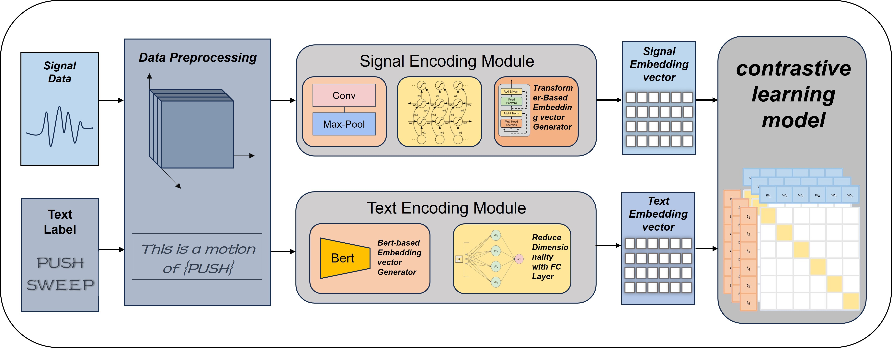

# Wi-CLIP: Toward Zero-Shot Air Gesture Recognition Based on RF-Text Foundation Model

---
Currently, we provide deep learning modeling code and preprocessed datasets.

## instruction 

This is a **WiFi-Text CLIP model** designed to align **BVP (Body-coordinate Velocity Profile)** data in WiFi signals
with text descriptions to enable **zero-shot learning**. The model utilizes the **CNN+RNN+Transformer structure as the WiFi data encoder** and
adopts **BERT as the text encoder** to establish an efficient cross-modal representation mapping between WiFi sensing data and natural language.

## Installation Requirements

Recommended to use **conda** installation.

    # Creating the Environment（Python 3.10）
    conda create -n my_env python=3.10
    conda activate my_env
    
    # Installation of the Scientific Computing Foundation Library
    conda install numpy scipy pandas matplotlib scikit-learn seaborn -c conda-forge
    
    # Installing PyTorch（GPU，CUDA 12.1）
    conda install pytorch torchvision torchaudio pytorch-cuda=12.1 -c pytorch -c nvidia
    
    # Installing the HuggingFace library
    pip install transformers==4.48.0

## Dataset Download

The BVP data for the corresponding gesture exists in the Data folder, please download the original CSI data from the following link:

<https://ieee-dataport.org/open-access/widar-30-wifi-based-activity-recognition-dataset>

## Pre-training with data

### To use the current dataset with the training model ,please run

> python -m + Specific file name

like:

> python -m src/WiFi-ZeroShot

